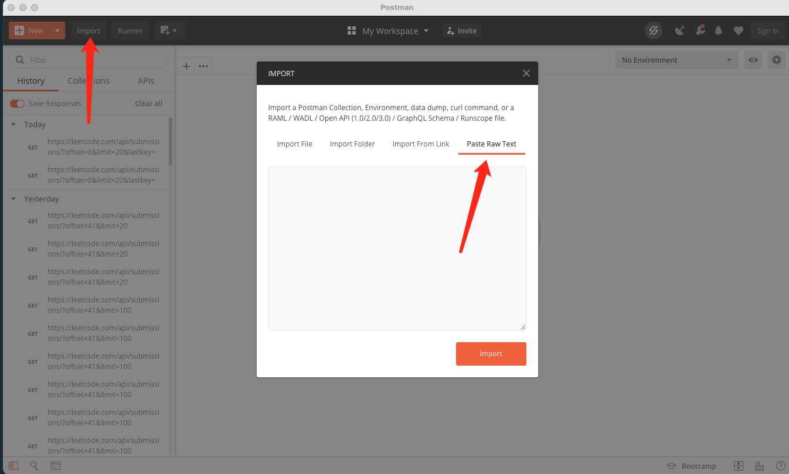
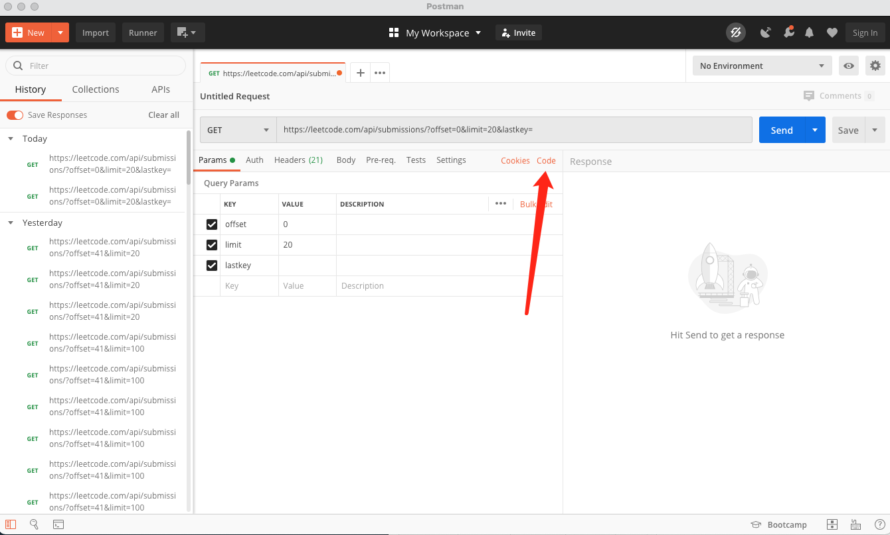
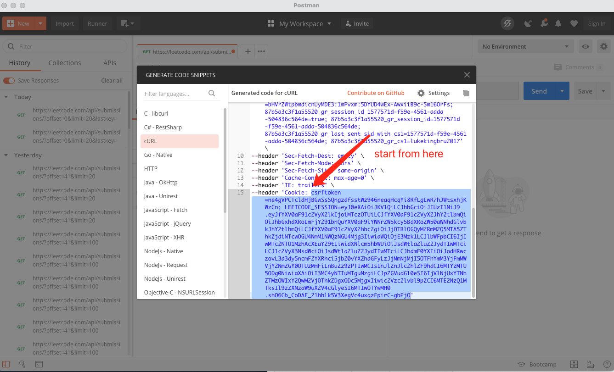

# leetcode_progress_bar

## Basic use (Mac Only)

1. Download binary file from here: [lcp](lcp)
   
2. `chmod +x ./lcp`
2. Try run `./lcp progress -t day`
3. Open Preference --> Security & Privacy --> General
4. Allow lcp

```bash
chmod +x ./lcp

./lcp cookie -s '{PASTE YOUR COOKIE HERE}'

./lcp progress -t day
./lcp progress -t month
./lcp progress -t year
```
## Troubleshooting

If you run `lcp progress` but the total number is not accurate, try these command to cleanup:
```bash
# remove the log files
./lcp reset -f data

# re-run
./lcp progress -t day
```

## How to get your leetcode cookie?

1. Open your browser
2. Inspect --> Network
3. Go to https://leetcode.com/submissions/
4. Filter the requests by "api/sub"
5. Copy as cURL and find the cookie


#### Below is the instruction if you are using Firefox
#### I got issues when copy cookie directly from firefox

6. Open postman
7. Import -> Paste Raw text and import
   


8. After import, click code



9. Scroll down to the end and copy the last Cookie

