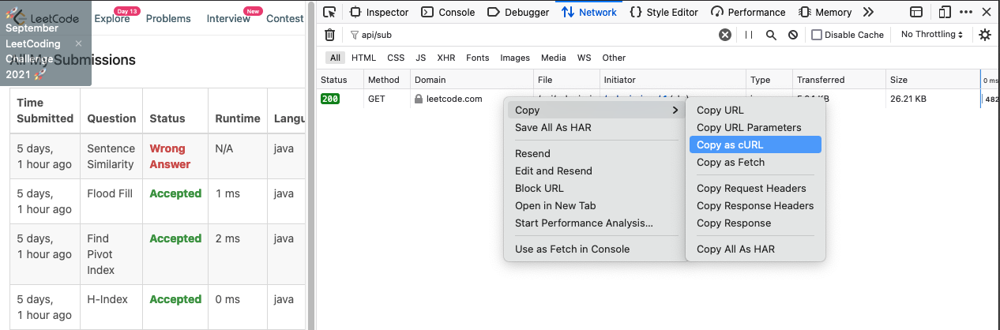

# leetcode_progress_bar

## Basic use

```bash
git clone git@github.com:xilu-wang/leetcode_progress_bar.git

cd leetcode_progress_bar

./leetcode_progress_bar cookie -s '{PASTE YOUR COOKIE HERE}'

./leetcode_progress_bar progress -t day
./leetcode_progress_bar progress -t month
./leetcode_progress_bar progress -t year
```

## How to get your leetcode cookie?

1. Open your browser
2. Inspect --> Network
3. Go to https://leetcode.com/submissions/
4. Filter the requests by "api/sub"
5. Copy as cURL




6. Open postman
7. Import -> Paste Raw text and import
   


8. After import, click code


9. Scroll down to the end and copy the last Cookie

